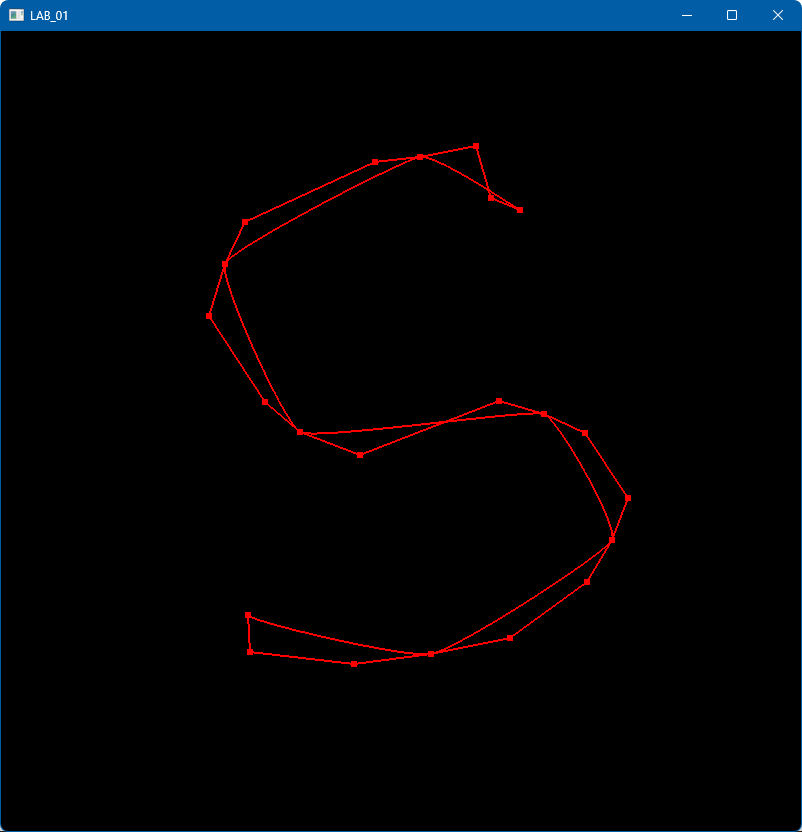
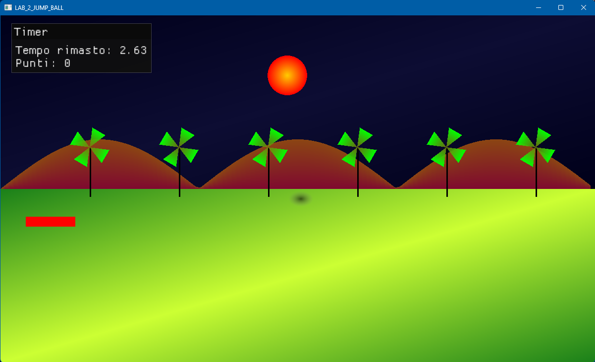
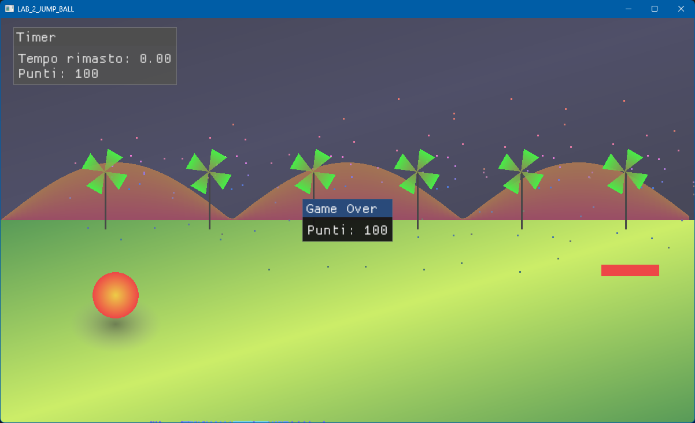
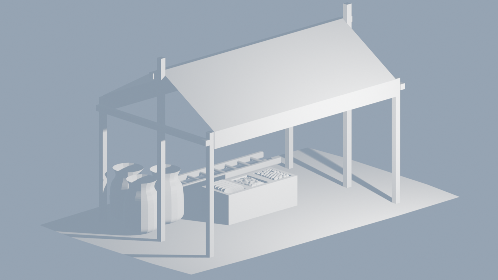

# 📐 Computer Graphics Labs

Raccolta di laboratori realizzati per l’esame di **Computer Graphics**.

---

## 🎞️ Gallery dei laboratori

### LAB_01 – Disegno di curve di Bézier

  

---

### 🔷 LAB_02 – 2D Animazione & Gameplay 

  
  

---

### 🔷 LAB_04 – Modellazione con Blender 

  

---

### 🔷 LAB_05 – Camera & Projections  

  
  

